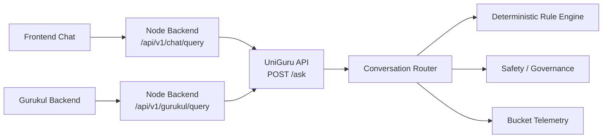

# UniGuru Live Integration Architecture



## Request Contracts

### Product Chat to UniGuru
```json
{
  "query": "What is a qubit?",
  "context": {
    "caller": "bhiv-assistant"
  }
}
```

### Gurukul to UniGuru
```json
{
  "query": "Explain Pythagoras theorem",
  "context": {
    "caller": "gurukul-platform",
    "student_id": "S-102"
  }
}
```
